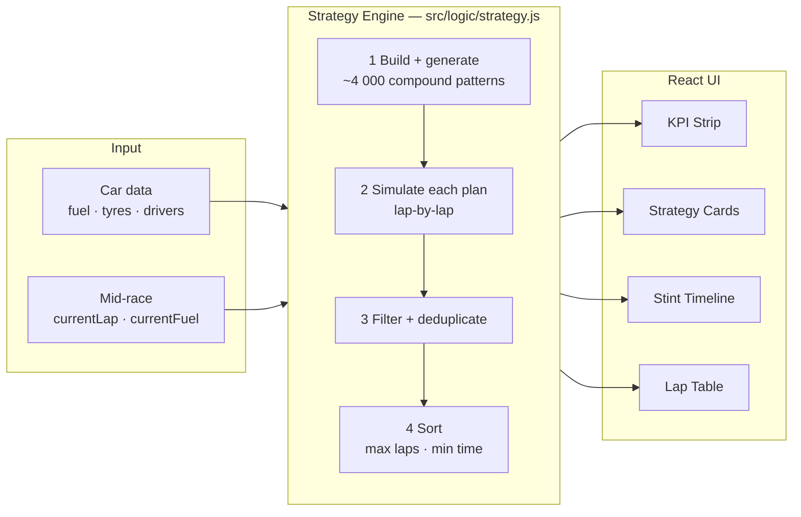
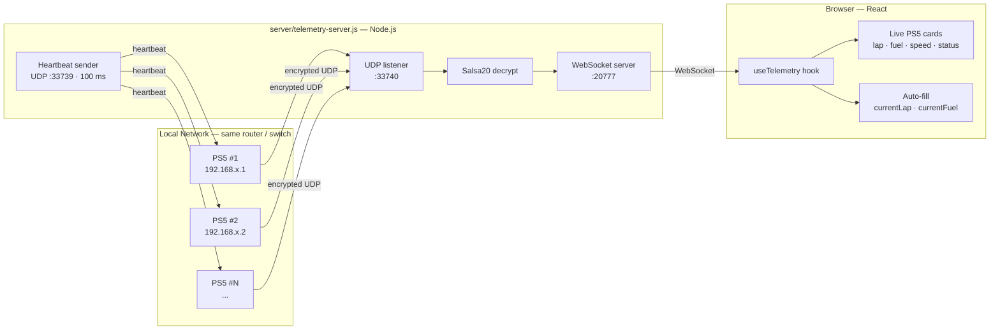

<div align="center">


<br>


<br>

> **Endurance race strategy calculator for Gran Turismo 7.**
> Enumerates every valid tyre-compound sequence, simulates each race lap‑by‑lap,
> and surfaces the plan that maximises your lap count — optionally driven by
> live PS5 telemetry for real-time mid-race recalculation.

<br>


</div>

<br>

---

<a id="table-of-contents"></a>


<br>

- [Race Specifications](#race-specifications)
- [Under the Hood — Strategy Engine](#under-the-hood)
- [Pit Wall — Live PS5 Telemetry](#pit-wall)
- [Pole Position Setup](#pole-position-setup)
- [Pre-Race Briefing](#pre-race-briefing)
- [Quality Control — Tests](#quality-control)
- [Technical Regulations — Architecture](#technical-regulations)
- [Power Unit — Tech Stack](#power-unit)

<br><br>

<a id="race-specifications"></a>


<br>

| Feature | What it means at race pace |
| :--- | :--- |
| **Full strategy enumeration** | Every valid pit + compound sequence tested — up to 5-element cyclic patterns, ~4 000 combinations for 5 compounds. If spamming Softs beats running Hards, it finds that. |
| **Fuel weight model** | Corrects per-lap time for a progressively lighter car as fuel burns. Enter your times at full tank — the engine handles the conversion every lap. |
| **Exact fuel carry-over** | Leftover fuel from a stint is rolled into the next refuel calculation, so you never top up more than necessary. |
| **Pit window bands** | Visualised on the strategy timeline. Always see the absolute latest lap you can pit without running dry or destroying tyres. |
| **Multi-driver support** | Per-driver lap times per compound, configurable minimum drive time, greedy stint assignment that guarantees every driver meets their requirement. |
| **Mid-race recalculation** | Enter current lap + fuel for an updated strategy on the fly. Connects directly to live PS5 telemetry for automatic updates. |
| **Live PS5 telemetry** | Monitor all PS5s in the room simultaneously — lap, fuel remaining, speed, last lap time, and pit / on-track status. |
| **Print export** | Full stint plan printed via browser print dialog — hand it to your co-driver. |

<br><br>

<a id="under-the-hood"></a>


<br>

`src/logic/strategy.js` is pure JavaScript with **zero React dependency** — it runs in the browser and directly in Node.js for testing. The entry point is `findBestStrategies(inputs)`.



<br>

Each simulated plan runs the following per lap:

| Step | What the engine computes |
| :--- | :--- |
| Tyre degradation | Piecewise curve: `start → half` over 0–50% tyre life, `half → end` over 50–100% |
| Fuel weight | `dynamicLapTime = base + (fuelNow − tankSize) × penalty` — car gets faster every lap as fuel burns |
| Fuel carry-over | Leftover fuel rolls into the next stint's refuel calculation |
| Tyre change decision | Changed when compound differs, or remaining life won't cover the next stint |
| Mandatory stop capping | Stint length shortened to guarantee the required number of pit stops |
| Multi-driver assignment | Driver with the most outstanding minimum-time debt gets the next stint |

<br>

<details>
<summary><b>Fuel-weight correction model</b></summary>
<br>

The user observes lap times at full tank. Because fuel weight slows the car, the engine first converts those observed times to **full-tank equivalents** by adding back the weight penalty that was already burned off:

```
t_fullTank(mid) = t_observed(mid) + (tankSize − fuelAtMid) × penalty
t_fullTank(end) = t_observed(end) + (tankSize − fuelAtEnd) × penalty
```

During simulation, each lap's time is adjusted for the actual live fuel level:

```
dynamicLapTime = baseLapTime + (fuelAtStartOfLap − tankSize) × penalty
```

At 0.03 s/L on a 100 L tank: **3 s difference** between a full tank and empty.

</details>

<details>
<summary><b>Tyre degradation model</b></summary>
<br>

Each compound has three user-supplied lap times: `startLapTime`, `halfLapTime`, `endLapTime`. The engine uses a **piecewise linear** curve:

| Phase | Tyre age | Interpolation |
| :--- | :--- | :--- |
| Fresh | 0 → 50% of tireLife | `start` → `half` |
| Worn | 50 → 100% of tireLife | `half` → `end` |

This captures the typical GT7 pattern where grip drops faster in the second half of a stint. Both fuel-weight correction and tyre degradation are applied simultaneously each lap.

</details>

<br><br>

<a id="pit-wall"></a>


<br>

GT7 streams live **Salsa20-encrypted UDP packets** from the PS5 to any machine on the same LAN. The relay server decrypts and forwards them to the browser in real time over WebSocket.



<br>

<details open>
<summary><b>Network requirements</b></summary>
<br>

| Requirement | Detail |
| :--- | :--- |
| **Same LAN** | PS5 and laptop on the same router or switch |
| **Laptop firewall** | Allow UDP inbound `:33740`, outbound `:33739` |
| **PS5** | Nothing to install — GT7 streams natively |
| **Wi-Fi vs wired** | Both work; wired is more reliable at events |
| **Online lobbies** | Telemetry is local — works in private online races regardless of session routing |

</details>

<br>

### Setup

**1. Start the relay server**

```bash
npm run telemetry
# or: node server/telemetry-server.js
```

**2. Open the app → GT7 Live Telemetry section**

Add each PS5's IP, leave the server URL as `ws://localhost:20777`, click **Connect**.

> Find a PS5's IP: **Settings → Network → View Connection Status → IP Address**

**3. Enable auto-fill (optional)**

Enable **Mid-Race Recalculation** in the sidebar, then click a PS5 card to pin it. Current lap and fuel update automatically every telemetry packet — strategy recalculates in real time.

> **All 10 PS5s in one room?** One laptop, one relay server instance. It handles all of them simultaneously.

<br><br>

<a id="pole-position-setup"></a>


<br>

### Prerequisites


### Install & run

```bash
git clone https://github.com/Jeremy-Luyckfasseel/Race-Strategies.git
cd Race-Strategies
npm install
npm run dev        # → http://localhost:5173
```

### All commands

| Command | Description |
| :--- | :--- |
| `npm run dev` | Dev server at `http://localhost:5173` |
| `npm run build` | Production build → `/dist` |
| `npm run preview` | Preview the production build |
| `npm test` | Full test suite — 1 715 assertions |
| `npm run test:smoke` | Quick 1-hour race smoke test |
| `npm run telemetry` | Start the UDP → WebSocket relay server |

<br><br>

<a id="pre-race-briefing"></a>


<br>

**Data to collect in GT7 before entering values into the calculator:**

| Input | How to measure in GT7 | Tip |
| :--- | :--- | :--- |
| `lapsPerFullTank` | Free practice, full tank, fuel map 1 — count laps until low-fuel warning | Repeat on the fuel map you will race on |
| `startLapTime` | Lap 1 on fresh tyres at full tank | Use a consistent pace, not your personal best |
| `halfLapTime` | Lap ≈ `tireLife / 2` on the same set | Same fuel map, same pace style |
| `endLapTime` | Last safe lap on that set before pitting | When you'd normally box — not when the tyre explodes |
| `tireLife` | Free practice — push the set until handling degrades significantly | Count laps from new |
| `pitBaseSecs` | Time from pit entry to exit with no refuel and no tyre change | Measure from replay |
| `tireChangeSecs` | Extra time added when tyres are changed | `pitWithTyres − pitWithoutTyres` from replay |
| `fuelWeightPenalty` | Lap 1 time (full tank) vs final lap time (near empty) divided by litres burned | 0.030 s/L is a safe GT7 default |

<br><br>

<a id="quality-control"></a>


<br>

The strategy engine has no React dependency and runs directly in Node:

```bash
npm test              # 1 715 assertions across two suites
npm run test:smoke    # 1-hour race smoke test
```

| Suite | File | Tests | Covers |
| :--- | :--- | :---: | :--- |
| **Comprehensive** | `tests/test_comprehensive.js` | 129 | Helpers, degradation curve, fuel tracking, pit timing, mandatory compound filter, mid-race mode, fuel weight penalty |
| **Invariants** | `tests/test_invariants.js` | 1 586 | Structural invariants on every result, ranking correctness, multi-compound enumeration, multi-driver minimums, race time boundary, known-answer scenarios, bulk no-overfill / no-tyre-overrun sweeps |

<br><br>

<a id="technical-regulations"></a>


<br>

```text
📦 Race-Strategies/
 ┣ 📂 src/
 ┃ ┣ 📂 components/
 ┃ ┃ ┣ 📄 InputPanel.jsx          sidebar form — car presets, compounds, drivers, telemetry
 ┃ ┃ ┣ 📄 ResultsSummary.jsx      KPI strip + top-6 strategy comparison cards
 ┃ ┃ ┣ 📄 StrategyTimeline.jsx    Recharts bar chart with pit-window bands
 ┃ ┃ ┗ 📄 StintTable.jsx          lap-by-lap stint detail table
 ┃ ┣ 📂 hooks/
 ┃ ┃ ┣ 📄 useStrategy.js          debounced wrapper around findBestStrategies() (600 ms)
 ┃ ┃ ┗ 📄 useTelemetry.js         WebSocket hook — auto-fills currentLap / currentFuel
 ┃ ┣ 📂 logic/
 ┃ ┃ ┗ 📄 strategy.js             ⭐ pure-JS engine · zero React · testable with node
 ┃ ┣ 📄 App.jsx                   root component — owns all state
 ┃ ┗ 📄 index.css                 dark racing theme (gold #FFD700)
 ┣ 📂 server/
 ┃ ┗ 📄 telemetry-server.js       Node.js UDP relay — Salsa20 decrypt → WebSocket
 ┣ 📂 tests/
 ┃ ┣ 📄 test.js                   smoke test
 ┃ ┣ 📄 test_comprehensive.js     129 unit tests
 ┃ ┗ 📄 test_invariants.js        1 586 invariant & correctness tests
 ┗ 📄 package.json
```

<br>

State lives exclusively in `App.jsx` — no Redux, no Context. The strategy engine is intentionally decoupled from React so it can be tested with plain `node` and stays portable to any environment.

<br><br>

<a id="power-unit"></a>


<br>

<div align="center">


</div>

<br><br>

<div align="center">


</div>
