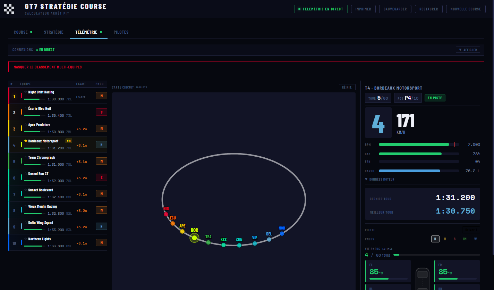
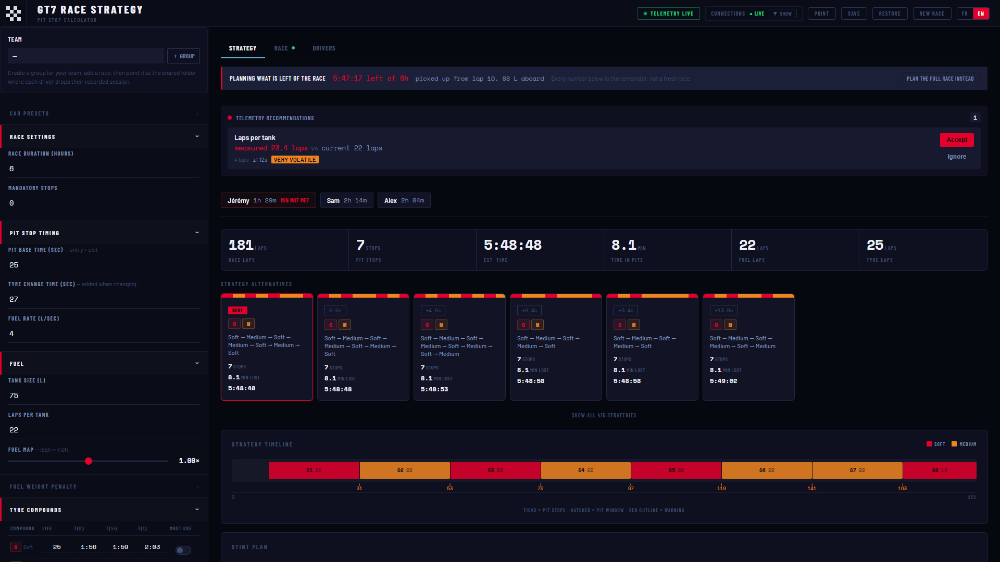
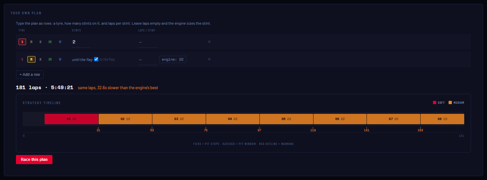
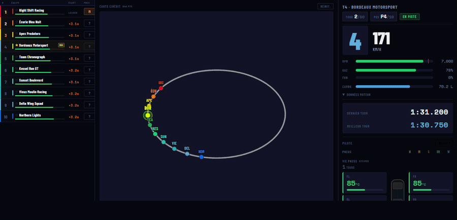
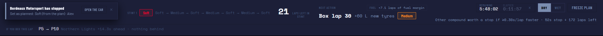
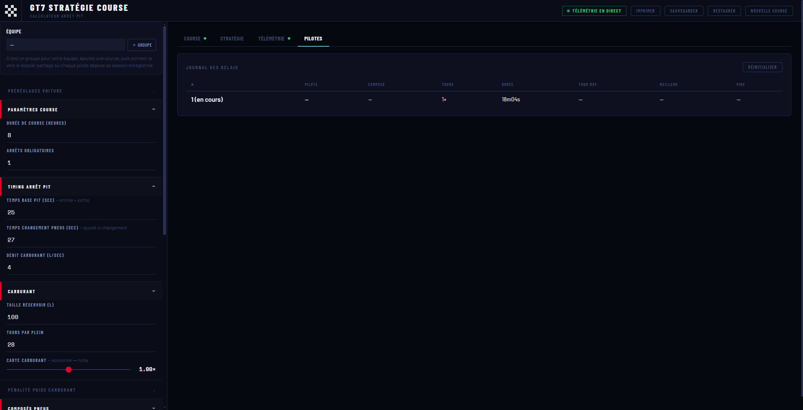
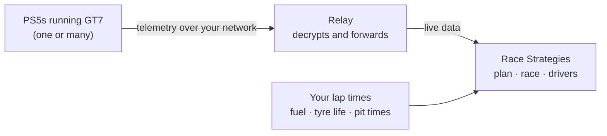

<div align="center">

# Race Strategies

**Endurance race strategy for Gran Turismo 7 — planned before the race, kept right during it.**

[](https://github.com/Jeremy-Luyckfasseel/Race-Strategies/actions/workflows/ci.yml)
[](https://github.com/Jeremy-Luyckfasseel/Race-Strategies/releases/latest)
[](LICENSE)


[Download](#download) · [Features](#features) · [How it works](#how-it-works) · [Getting started](#getting-started) · [FAQ](#faq) · [Development](#development)

<br>



</div>

<br>

Race Strategies tests every tyre and pit-stop combination for your race and tells you which one finishes the most laps. Then it follows the race with you. It reads live telemetry from every PS5 on your network, so the plan keeps up with your real fuel, tyres and race clock, and it shows the whole field on one screen.

It is made for long GT7 races: team events, league endurance rounds and 24-hour attempts, where the pit wall matters as much as the driver.

## Features

### Plan the race



- **Every strategy, ranked.** Thousands of tyre sequences are simulated lap by lap and ranked by laps completed, then by race time. If running Softs all race beats Hards, it will find that.
- **Real car behaviour.** The car gets faster as fuel burns off and slower as the tyres wear. Every pit stop costs what it really costs: the stop itself, the tyre change and the refuelling time.
- **Drivers and rules.** Several drivers with a minimum drive time each, compounds that must be used, and a required number of stops.
- **Your own plan.** Type a strategy in as a few rows ("2 stints on Soft, then Medium to the flag"). The same engine runs it and shows how it compares to the best plan.



### Run the race



- **The plan strip.** Current stint, laps left, the lap to box on and how much fuel to add. It also shows where you would rejoin if you boxed this lap.
- **A plan that follows the race.** Press *Start race* and the plan is recalculated from the race clock and your car's live lap, fuel and tyres. Nothing has to be typed in mid-race.
- **The whole field.** Every PS5 on the network in one leaderboard with real gaps, and a track map drawn from the cars' own GPS.
- **Rivals you follow.** You get a notice when they stop, a prompt for their tyre while the game still shows it, and a note of who still owes a mandatory compound.
- **Decisions, not just data.** *Box now or wait?* and *repair now or at the next stop?* are both answered by running the real strategy engine, not a rule of thumb. There is also a safety-car mode.
- **It learns your car.** Fuel burn and tyre fall-off are measured from telemetry and offered as updates to your setup.



### Manage the drivers



Each driver's time against the minimum, every stint with its tyre and lap times, and how long each compound has really lasted.

**Also:** English and French, a printable stint plan to hand to your co-driver, and one-click save/restore to move a whole session to another PC.

## How it works


```mermaid
flowchart LR
    PS5["PS5s running GT7<br/>(one or many)"] -- "telemetry over your network" --> RELAY["Relay<br/>decrypts and forwards"]
    RELAY -- "live data" --> APP["Race Strategies<br/>plan · race · drivers"]
    SETUP["Your lap times<br/>fuel · tyre life · pit times"] --> APP
```

1. **You describe your car.** Enter lap times on each compound, how far a tank lasts and how long a pit stop takes. Or let the app measure them from a practice session.
2. **The engine simulates the race.** Every sensible tyre sequence is driven lap by lap, with fuel, weight, tyre wear and pit time all counted, and the plans are ranked.
3. **Telemetry keeps it honest.** GT7 streams encrypted telemetry to any PC on the same network. A small relay decrypts it and passes it to the app. From then on, the plan follows the car rather than your guesses.

The strategy engine is plain JavaScript with no UI attached, so it is tested on its own: 49 test suites run on every push. For the details, see [`docs/CURRENT_STATE.md`](docs/CURRENT_STATE.md) (how the parts fit together) and [`docs/DECISIONS.md`](docs/DECISIONS.md) (why it was built this way).

## Getting started

### Download

Grab the Windows installer from the **[latest release](https://github.com/Jeremy-Luyckfasseel/Race-Strategies/releases/latest)**. It includes the relay, so there is nothing else to install. The newest features land in the source first (see below) before they reach a release.

### Run from source

Requires [Node.js](https://nodejs.org) 20.19+ or 22.12+.

```bash
git clone https://github.com/Jeremy-Luyckfasseel/Race-Strategies.git
cd Race-Strategies
npm install

npm run telemetry   # terminal 1: the relay that talks to the PS5s
npm run dev         # terminal 2: the app, at http://localhost:5173
```

### Connect your PS5

1. Put the PS5 and the PC on the **same network**. Wired is best at events.
2. Open the app. It connects to the relay and scans for PS5s by itself. On Windows, click **Allow** when asked for network access.
3. On the **Race** tab, mark your car with ★. Press **Start race** when the lights go out.

To add a PS5 by hand, open **Connections → Show** in the header. You can find the PS5's IP under *Settings → Network → View Connection Status*. One PC and one relay handle a whole room of consoles.

### No PS5? Try the demo

```bash
npm run demo        # ten simulated cars, sending real encrypted telemetry
```

Run it next to the relay and the app. The simulated cars lap, burn fuel and pit, so every screen has something real to show. If you are using the installed app instead, skip `npm run telemetry`, because the app starts its own relay.

### Before your race

The plan is only as good as the numbers you give it. In practice, measure:

| What | How |
| :--- | :--- |
| **Laps per tank** | Start on a full tank and count laps until the fuel warning, on the fuel map you will race on. |
| **Lap times per compound** | First lap on fresh tyres with a **full tank**, a lap at half tyre life, and the last lap before you would box. All from one uninterrupted stint. |
| **Tyre life** | Laps until the car handles noticeably worse. |
| **Pit times** | From a replay: a stop with no service, then the extra time a tyre change adds. |

Presets for a few cars are built in. Once telemetry is running, the app measures fuel burn and tyre fall-off itself and suggests corrections.

## FAQ

<details>
<summary><b>Why does it ask me which tyre a car is on?</b></summary>
<br>
GT7's telemetry does not include the tyre compound. After your own stops, the app assumes the plan's next tyre, and you can correct it with one click. For rivals you follow, it asks while the car sits in the pit box, which is when the game still shows its tyres.
</details>

<details>
<summary><b>Why is there no tyre wear percentage?</b></summary>
<br>
GT7 does not report tyre wear either. Tyre life is counted in laps on the current set and compared with how long your previous sets lasted. Tyre temperatures are shown per corner.
</details>

<details>
<summary><b>The app can't find my PS5.</b></summary>
<br>
Check that both devices are on the same network and subnet, and that the router's "AP/client isolation" is off. The PC's firewall must allow UDP in on port <code>33740</code> and out on <code>33739</code>. GT7 has to be running: the console only streams while the game is open.
</details>

<details>
<summary><b>Does it know when it rains?</b></summary>
<br>
No. The <b>Dry / Wet</b> switch on the Race tab only limits which compounds the plan may use. Intermediate and Wet are as fast as the lap times you measure for them.
</details>

<details>
<summary><b>Does it work in online lobbies?</b></summary>
<br>
Yes. Telemetry travels from each console to your PC over your own network, however the race itself is hosted. Every car you want to see must be on that network.
</details>

## Development

| Command | What it does |
| :--- | :--- |
| `npm run dev` | Start the app with hot reload |
| `npm run telemetry` | Start the UDP → WebSocket relay |
| `npm run demo` | Ten simulated PS5s for testing without hardware |
| `npm test` | Run all 49 test suites. Judge it by the **exit code**. |
| `npm run lint` | ESLint; kept at zero errors |
| `npm run build` | Production build to `dist/` |
| `npm run dist` | Build the Windows installer |

```text
src/logic/       the strategy engine and race logic: plain JavaScript, no React, runs under node
src/components/  the React screens
src/hooks/       telemetry connection, stint log, strategy runner
src/i18n/        English and French strings
server/          the telemetry relay
electron/        the desktop app wrapper
tests/           engine, relay and UI tests (no test runner, plain node)
```

The look and the rules behind it are in [`docs/DESIGN.md`](docs/DESIGN.md), and planned work is in [`docs/BACKLOG.md`](docs/BACKLOG.md).

## Contributing

Issues and pull requests are welcome. Before you open a PR:

- run `npm test` and `npm run lint`, and keep both green;
- give UI changes a test in `tests/test_ui_*.js`;
- put every visible string in `src/i18n/`, in both languages.

## License

[MIT](LICENSE) © Jeremy Luyckfasseel

*Gran Turismo is a trademark of Sony Interactive Entertainment. This project is not affiliated with, or endorsed by, Sony Interactive Entertainment or Polyphony Digital.*
